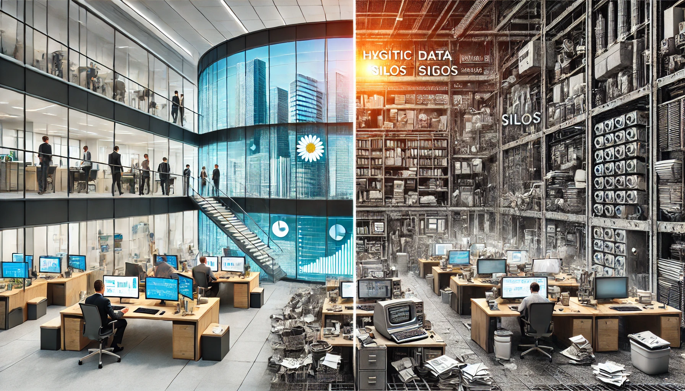

# DSI - *Introducción*

## ¿Por qué?

A enero de 2024, existen aproximadamente 5.35 billones de usuarios de internet en todo el mundo, representando el 66.2% de la población mundial.

.png)

|Indicador|Valor|Cambio Anual|
|-|-:|-:|
|Usuarios de Internet|5.35 billones|+1.8% (+97M)|
|Penetración global|66.2%|+0.9% (+60 BPS)|
|Penetración en mujeres|63.5%|+4.9% (+304 BPS)|
|Penetración en hombres|68.8%|+4.2% (+285 BPS)|
|Penetración urbana|78.8%|+3.2% (+252 BPS)|
|Penetración rural|48.9%|+7.2% (+340 BPS)|
|Uso vía móvil|96.5%|+4.6% (+420 BPS)|
|Uso vía PC/laptop|61.8%|-5.8% (-380 BPS)|
|Tiempo promedio diario|6h 40m|+0.8% (+3 min)|

> La tasa de penetración de Internet se refiere al porcentaje de hogares (con al menos un miembro entre los 16 y los 74 años) que tienen acceso a internet en casa

***Fuente:*** [Simon Kemp](https://datareportal.com/people/simon-kemp)@[Digital 2024 Global Overview Report](https://datareportal.com/reports/digital-2024-global-overview-report)

### Actividad digital

|16 a 24 años|25 a 34 años|35 a 44 años|45 a 54 años|55 a 64 años|
|:-:|:-:|:-:|:-:|:-:|
|Buscar información 60.7%|Buscar información 58.7%|Buscar información 59.7%|Buscar información 62.1%|Buscar información 66.9%|
|Contactar amigos y familia 59.2%|Contactar amigos y familia 55.6%|Contactar amigos y familia 55.7%|Contactar amigos y familia 56.3%|Seguir noticias y eventos 59.1%|
|Ver videos y programas 58.4%|Ver videos y programas 54.1%|Seguir noticias y eventos 52.9%|Seguir noticias y eventos 54.8%|Contactar amigos y familia 56.3%|
|Escuchar música 54.8%|Seguir noticias y eventos 49.4%|Ver videos y programas 51.7%|Aprender a hacer cosas 49.2%|Aprender a hacer cosas 51.4%|
|Educación y estudio 53.0%|Encontrar nuevas ideas 47.9%|Aprender a hacer cosas 48.9%|Ver videos y programas 48.8%|Investigar marcas 46.7%|
|Aprender a hacer cosas 51.1%|Aprender a hacer cosas 47.7%|Encontrar nuevas ideas 46.0%|Investigar marcas 44.8%|Ver videos y programas 43.0%|
|Encontrar nuevas ideas 50.3%|Escuchar música 46.6%|Investigar marcas 44.9%|Encontrar nuevas ideas 42.3%|Investigar lugares y viajes 40.7%|
|Tiempo libre y navegación 48.3%|Investigar marcas 43.0%|Escuchar música 42.6%|Tiempo libre y navegación 40.9%|Encontrar nuevas ideas 39.8%|
|Seguir noticias y eventos 47.8%|Tiempo libre y navegación 41.5%|Tiempo libre y navegación 41.1%|Escuchar música 39.4%|Investigar salud 39.8%|
|Juegos 41.6%|Educación y estudio 39.0%|Investigar lugares y viajes 39.1%|Investigar lugares y viajes 38.9%|Tiempo libre y navegación 38.9%|

---

|||
|:-:|:-:|
|TikTok|Instagram|

### Complejidad organizacional

La gestión de sistemas de información se ha vuelto crítica debido a:

|Integración de sistemas|Gestión del trabajo|Ciberseguridad|
|-|-|-|
|Coexistencia de sistemas legacy con tecnologías emergentes.|Equipos distribuidos globalmente.|Amenazas cada vez más sofisticadas.|
|Necesidad de interoperabilidad entre plataformas.|Colaboración híbrida y asíncrona.|Regulaciones más estrictas.|
|Gestión de arquitecturas híbridas (on-premise y cloud).|Nuevas metodologías de trabajo ágil.|Protección de activos digitales.|
||Automatización de procesos.|Gestión de identidades y accesos.|

### Impacto económico

|Inversión en transformación digital|Costos de incidentes|Productividad y eficiencia|
|:-:|:-:|:-:|
|Gasto global proyectado para 2025: $2.8 trillones|Pérdidas por ciberataques: $10.5 trillones anuales ([***estimado***](https://cloud.google.com/security/resources/cybersecurity-forecast?hl=es))|Incremento en productividad por IA: 40%|
|ROI medio de proyectos digitales: 54%|Tiempo medio de inactividad por fallos: 23 horas/año|Reducción de costos operativos: 30%|
|Tiempo medio de amortización: 14 meses|Costo medio por violación de datos: $4.35 millones|Mejora en tiempo de respuesta: 60%|

### Desafíos sociales y éticos

|Brecha digital|Privacidad y ética|Sostenibilidad|
|-|-|-|
|Desigualdad en acceso a tecnología.|Protección de datos personales.|Huella de carbono digital.|
|Diferencias en alfabetización digital.|Consentimiento informado.|Consumo energético de centros de datos.|
|Barreras de accesibilidad.|Sesgos algorítmicos.|Obsolescencia tecnológica.|
|Exclusión tecnológica.|Transparencia en IA.|Economía circular digital.|

### Evolución de roles y competencias

|Término|Relacionado a...|
|-|-|
|Prosumidor|productor-consumidor.|
|Sellsumer|seller-consumer.|
|Creator|creador de contenido digital.|
|AI engineer prompt|ingeniero de prompts para IA.|
|DAO participant|participante en organizaciones autónomas descentralizadas.|
|Iniciativas crowd|Crowdsourcing, crowdfunding, crowdgifting, tokenización.|
|Consumo colaborativo|Coworking, coliving, movilidad compartida, economía circular.|

### Velocidad de cambio tecnológico

1. Generación de datos
   Período|Cantidad
   -|-:
   Hasta el 2003|5 [exabytes](https://es.wikipedia.org/wiki/Exabyte)
   Solo en el 2007|281 exabytes
   2023|120 [zettabytes](https://es.wikipedia.org/wiki/Zettabyte) (120,000 exabytes)
   2025 (proyección)|181 zettabytes
2. Ciclos de innovación
   - IA generativa: nuevas versiones cada 3-6 meses (**🤣🤣🤣**)
   - Dispositivos móviles: ciclos de 12-18 meses
   - Sistemas empresariales: actualizaciones continuas.

### Competitividad empresarial

|Disrupciones tecnológicas|Gestión del conocimiento|
|-|-|
|Modelos de negocio tradicionales amenazados.|Obsolescencia de habilidades técnicas.|
|Nuevos competidores nativos digitales.|Aprendizaje continuo.|
|Necesidad de innovación continua.|Retención de talento digital.|
|Time-to-market acelerado.|Cultura de innovación.|

### Retos, oportunidades

|Riesgos emergentes|Oportunidades|
|-|-|
|Dependencia tecnológica crítica.|Nuevos mercados digitales.|
|Obsolescencia acelerada.|Modelos de negocio innovadores.|
|Ciberamenazas avanzadas.|Eficiencia operativa.|
|Regulaciones cambiantes.|Personalización masiva.|
||Innovación colaborativa.|

### #2Think

## ¿Qué?

### Sistema

> Un Sistema es un conjunto de componentes interactuando o interdependientes formando un todo integrado. Cada sistema está delimitado por sus límites espacio/temporales e influenciado por su entorno, descrito por su estructura y propósito y expresado en su funcionamiento.

#### Sistema complejo

> Un Sistema complejo es aquel cuya complejidad excede la capacidad intelectual humana, requiriendo la asistencia de sistemas inteligentes para su comprensión y gestión.

### Sistema de Información

Un sistema de información es un conjunto de elementos orientados al tratamiento y administración de datos e información, organizados y listos para su uso posterior, generados para cubrir una necesidad o un objetivo. En la era de la IA, incluye también la capacidad de procesamiento autónomo y toma de decisiones asistida.

### Dirección

La dirección en el contexto actual implica la capacidad de gestionar sistemas socio-técnicos complejos, integrando personas, tecnología y procesos en un entorno de cambio constante y transformación digital.

### Dirección de Sistemas de Información

|D|S|I|
|-|-|-|
|Los Sistemas de Información son un ecosistema dinámico que integra tecnologías tradicionales y emergentes, donde la IA, la automatización y la sostenibilidad juegan un papel fundamental. La asignatura prepara al alumnado para liderar esta transformación.|Estudiamos las tecnologías desde una perspectiva holística que incluye su gestión técnica, impacto organizativo, implicaciones éticas y sostenibilidad.|La asignatura está dirigida tanto a futuros directores de Sistemas de Información como a profesionales que necesitan comprender y liderar la transformación digital en sus organizaciones, con especial énfasis en la gestión de tecnologías emergentes.|

## ¿Para qué?

### Aspiración: tener perspectiva empresarial

---

|Lo que se ve(nde)|La realidad interna|
|-|-|
|Empresas totalmente digitalizadas.|Sistemas legacy que sostienen operaciones críticas.|
|Procesos automatizados.|Procesos híbridos (digital-manual).|
|Decisiones basadas en datos.|Datos en silos y problemas de calidad.|
|Inversión.|Restricciones presupuestarias reales.|

|Desafíos directivos reales|Gestión de la deuda técnica|Restricciones operativas|
|-|-|-|
|Gestión de expectativas vs. capacidades reales.|Sistemas heredados críticos para el negocio.|Presupuestos limitados vs. necesidades crecientes.
|Balance entre innovación y estabilidad operativa.|Arquitecturas tecnológicas complejas y difíciles de modificar.|Cumplimiento regulatorio cada vez más exigente.
|Resistencia al cambio organizacional.|Costos ocultos de mantenimiento.|Conflictos entre departamentos por recursos y prioridades.
|Decisiones técnicas condicionadas por decisiones históricas.|Riesgos de obsolescencia tecnológica.|Necesidad de mantener la operación mientras se innova.
|Gestión de talento técnico escaso.|Dependencias de proveedores históricos.|

|
|:-:
|La realidad empresarial

### Objetivos

1. Desarrollar competencias directivas para la era digital: visión integrada de factores tecnológicos, humanos y organizativos en la toma de decisiones.
1. Definir y gestionar áreas de TI que integren tecnologías tradicionales y emergentes, con especial atención a la IA y la automatización.
1. Gestionar la innovación tecnológica de forma ética y sostenible.
1. Comprender el panorama tecnológico actual y emergente, con énfasis en:
    - IA generativa y sistemas autónomos.
    - Computación cuántica.
    - Web3 y blockchain.
    - Metaverso y realidad extendida.
1. Analizar el impacto de las tecnologías emergentes en:
    - Modelos de negocio digitales.
    - Transformación organizacional.
    - Sostenibilidad y ética.
    - Experiencia de usuario y cliente.
1. Estudiar casos prácticos sobre:
    - Implementación de IA en organizaciones.
    - Transformación digital sostenible.
    - Nuevos modelos de negocio digitales.
    - Gestión del cambio tecnológico.
1. Fomentar el emprendimiento digital y la innovación sostenible.
1. Conocer sobre herramientas:
    - Sistemas ERP cloud-native.
    - CRM con IA integrada.
    - Plataformas de automatización.
    - Herramientas de análisis de datos y BI.
    - Sistemas de gestión del conocimiento basados en IA.

## ¿Cómo?

|Dimensión|Detalle|
|-|-|
|**Estratégica**|Plan de estudios / Competencias / Resultados de aprendizaje|
|**Ejecutiva**|Temario / Sesiones híbridas / Evaluación continua y por proyectos|
