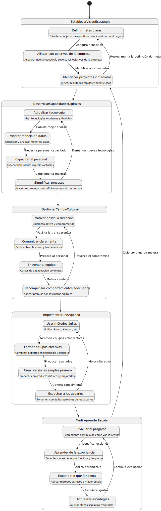

# Transformación digital

## ¿Por qué?

La transformación digital ha pasado de ser una opción a convertirse en un imperativo empresarial por varias razones críticas:

- **Cambio en las expectativas del cliente**: Los consumidores actuales esperan experiencias digitales fluidas, personalizadas y disponibles 24/7, independientemente del sector.
- **Presión competitiva**: Empresas nativas digitales están disrumpiendo industrias tradicionales con modelos de negocio más ágiles y eficientes.
- **Aceleración post-pandemia**: COVID-19 catalizó la adopción digital, convirtiendo en meses lo que habría tomado años.
- **Eficiencia operativa**: Las tecnologías digitales permiten automatizar procesos, reducir costos y mejorar la productividad.

|Kodak|Netflix|
|-|-|
|Ignoró la transición hacia lo digital en fotografía, pasando de líder de mercado a declararse en bancarrota en 2012.|Evolucionó de enviar DVDs por correo a convertirse en la plataforma de streaming global dominante y productor de contenido original.|
|
**Blockbuster**|
**Amazon**|
|Rechazó la oportunidad de adquirir Netflix por $50 millones en 2000, manteniendo su modelo de tiendas físicas.|Pasó de ser una librería online a convertirse en un ecosistema digital completo que abarca retail, cloud computing, entretenimiento y dispositivos inteligentes.|

En este contexto, entender y ejecutar la transformación digital no resulta ya solo una ventaja competitiva, sino que se convierte en un imperativo de supervivencia empresarial.

## ¿Qué?

La transformación digital es un **proceso** que reimagina cómo una organización crea y entrega valor a sus clientes mediante la integración de tecnologías digitales en todas sus áreas.

Va mucho más allá de una simple digitalización de procesos o implementación de nuevas tecnologías:

|Digitalización|Transformación digital|
|-|-|
|Conversión de información y procesos analógicos a formatos digitales|Reimaginación completa de modelos de negocio y experiencias del cliente|
|Enfoque en eficiencia operativa|Enfoque en creación de nuevo valor|
|Mejora lo existente|Crea nuevas posibilidades|
|Proyecto técnico|Iniciativa estratégica|

Los principales componentes de la transformación digital incluyen:

|Tecnología|Proceso|Adopción|
|-|-|-|
|**Tecnologías habilitadoras**|**Rediseño de procesos y experiencias**|**Cambio cultural y organizativo**|
|Computación en la nube|Optimización end-to-end de procesos|Adopción de metodologías ágiles|
|Inteligencia artificial y machine learning|Personalización de experiencias del cliente|Fomento de la experimentación y tolerancia al fracaso|
|Internet de las cosas (IoT)|Automatización y self-service|Trabajo colaborativo y multidisciplinar|
|Big data y analytics|Innovación en productos y servicios|Toma de decisiones basada en datos|
|Blockchain|
|Realidad aumentada/virtual|

## ¿Para qué?

La transformación digital, cuando se implementa efectivamente, genera múltiples beneficios:

- **Ventaja competitiva**: Permite a las organizaciones diferenciarse en mercados saturados y responder rápidamente a nuevas oportunidades.
- **Nuevos flujos de ingresos**: Facilita la creación de productos y servicios digitales innovadores que pueden generar nuevas fuentes de ingresos.
- **Mayor eficiencia operativa**: Automatiza procesos manuales y reduce costos operativos.
- **Mejora en la experiencia del cliente**: Proporciona experiencias más personalizadas, convenientes y satisfactorias.
- **Decisiones basadas en datos**: Aprovecha el análisis de datos para tomar decisiones más informadas y predictivas.
- **Agilidad organizativa**: Desarrolla la capacidad para adaptarse rápidamente a cambios en el mercado o disrupciones imprevistas.
- **Atracción y retención de talento**: Las organizaciones digitalmente maduras atraen mejor talento, especialmente entre las nuevas generaciones.

Según McKinsey, las empresas que han abordado la transformación digital de manera integral han visto aumentos de hasta 30% en la satisfacción del cliente, 30-50% en reducción de costos operativos y 20-30% en incremento de ingresos de nuevos productos digitales.

## ¿Cómo?

La transformación digital requiere un enfoque práctico y sistemático:

### 1. Establecer visión y estrategia claras

- **Definir metas claras**: Establecer objetivos específicos relacionados con el negocio
- **Alinear con objetivos de la empresa**: Asegurar que la tecnología soporte los objetivos generales
- **Identificar proyectos inmediatos**: Buscar resultados rápidos y beneficiosos para ganar impulso

### 2. Desarrollar capacidades digitales

- **Actualizar tecnología**: Usar tecnologías modernas y flexibles (como cloud, APIs)
- **Mejorar manejo de datos**: Organizar y analizar mejor los datos de la empresa
- **Capacitar al personal**: Enseñar habilidades digitales actuales a los empleados
- **Simplificar procesos**: Hacer los procesos más eficientes usando tecnología

### 3. Gestionar el cambio cultural

- **Motivar desde la dirección**: Liderazgo activo y comprometido con el cambio
- **Comunicar claramente**: Explicar bien la visión y los beneficios a todos
- **Entrenar al equipo**: Ofrecer cursos y capacitación continuos
- **Recompensar comportamientos adecuados**: Alinear premios con las metas digitales

### 4. Implementar con agilidad

- **Usar métodos ágiles**: Utilizar enfoques como Scrum o Kanban para avanzar rápido
- **Formar equipos efectivos**: Combinar expertos en tecnología y negocio
- **Crear versiones simples primero**: Empezar con productos básicos y mejorarlos con el tiempo
- **Escuchar a los usuarios**: Tomar en cuenta las opiniones de quienes usan los sistemas

### 5. Medir, aprender y escalar

- **Evaluar el progreso**: Seguimiento continuo de cómo van las iniciativas
- **Aprender de la experiencia**: Sacar lecciones de lo que funciona y lo que no
- **Expandir lo que funciona**: Aplicar los métodos exitosos a mayor escala
- **Actualizar estrategias**: Ajustar planes según los resultados obtenidos

La transformación digital no es un destino final sino un proceso continuo que requiere adaptarse constantemente a nuevas tecnologías y necesidades del mercado.

