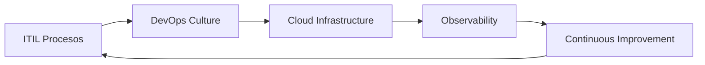

<style>
section {
  font-size: 30px;
}
h1 {
  color: #0366d6;
}
h2 {
  color: #0366d6;
}
.columns {
  display: grid;
  grid-template-columns: repeat(2, minmax(0, 1fr));
  gap: 1rem;
}
.columns-3 {
  display: grid;
  grid-template-columns: repeat(3, minmax(0, 1fr));
  gap: 1rem;
}
table {
  font-size: 24px;
}
.code-block {
  background-color: #f6f8fa;
  padding: 1rem;
  border-radius: 8px;
  font-family: monospace;
}
</style>

# Operaciones y Servicios (Parte 2)
### Enfoques modernos y gestión continua

---

## Contexto: Lo que hemos visto

<div class="columns">
<div>

### ITSM + ITIL
- Gestión de servicios estructurada
- Procesos estandarizados
- Enfoque en valor

</div>
<div>

### Infraestructura
- Servidores y administración  
- Cloud computing
- Modelos de implementación

</div>
</div>

**Ahora**: Evolucionando hacia enfoques modernos que aumentan agilidad y eficiencia

---

## Agenda

1. **DevOps y Site Reliability Engineering (SRE)**
2. **Automatización operativa**
3. **Observabilidad y monitorización**
4. **Medición y mejora de servicios**
5. **Continuidad y recuperación**
6. **Gobierno de servicios**

---

# DevOps & SRE

## La evolución de las operaciones


---

## La brecha Dev-Ops tradicional

<div class="columns">
<div>

### Desarrolladores
- **Objetivo**: Entregas rápidas
- **Métrica**: Features/sprint
- **Foco**: Innovación

</div>
<div>

### Operaciones
- **Objetivo**: Estabilidad
- **Métrica**: Uptime
- **Foco**: Control

</div>
</div>

**Resultado**: Conflicto de objetivos y silos organizacionales

---

## DevOps: Principios clave

1. **Cultura colaborativa**
2. **Automatización radical**
3. **Medición constante**
4. **Iteración y experimentación**
5. **Responsabilidad compartida**

<div class="code-block">
"You build it, you run it"
- Amazon Web Services
</div>

---

## site Reliability Engineering (SRE)

### El enfoque de Google

**SRE** = Cuando se pide a un ingeniero de software que diseñe un departamento de operaciones.

<div class="columns">
<div>

### Fundamentos SRE
- Error budgets
- Objetivos de nivel de servicio
- Automatización de tareas repetitivas
- Ingeniería de confiabilidad

</div>
<div>

### Métricas clave
- SLO (Service Level Objective)
- SLI (Service Level Indicator)
- SLA (Service Level Agreement)

</div>
</div>

---

## DevOps vs SRE vs ITIL

|Característica|DevOps|SRE|ITIL|
|-|-|-|-|
|**Enfoque**|Cultura y colaboración|Ingeniería de confiabilidad|Procesos estándar|
|**Origen**|Movimiento industria|Google|Gobierno UK/Industria|
|**Cambios**|Continuos|Basados en error budget|Controlados formalmente|
|**Focus**|Entrega rápida|Confiabilidad|Gobernanza|

---

## Implementación: Golden Signals

<div class="columns-3">
<div>

### Latency
Tiempo de respuesta 
de requests

</div>
<div>

### Traffic  
Volumen de demanda
del sistema

</div>
<div>

### Errors
Tasa de fallos
en requests

</div>
</div>

### Saturation
Utilización de recursos

---

# Automatización Operativa

## Eliminando el trabajo manual


---

## ¿Por qué automatizar?

<div class="columns">
<div>

### Problemas actuales
- Tareas repetitivas = errores
- Dependencia de personas
- Escalabilidad limitada
- Inconsistencia en entregas

</div>
<div>

### Beneficios  
- Reducción de errores
- Escalabilidad real
- Respuestas más rápidas
- Liberación de talento

</div>
</div>

---

## Niveles de automatización

|Nivel|Descripción|Ejemplos|
|-|-|-|
|**Básico**|Scripts para tareas simples|Cron jobs, backups|
|**Intermedio**|Orquestación de procesos|Ansible, Puppet|
|**Avanzado**|Infraestructura como código|Terraform, CloudFormation|
|**Inteligente**|Auto-reparación, ML/AI|Chaos engineering|

---

## Infrastructure as Code (IaC)

```terraform
resource "aws_instance" "web" {
  ami           = "ami-0c55b159cbfafe1f0"
  instance_type = "t2.micro"
  
  tags = {
    Name = "WebServer"
    Environment = "Production"
  }
}
```

**Beneficios**:
- Versionado 
- Revisiones
- Reproducibilidad
- Documentación viva

---

## CI/CD Pipeline

```yaml
# .gitlab-ci.yml
stages:
  - build
  - test  
  - deploy

deploy_production:
  stage: deploy
  script:
    - ./deploy.sh production
  environment:
    name: production
    url: https://app.example.com
```

---

## Herramientas modernas

<div class="columns-3">
<div>

### Configuración
- Ansible
- Puppet
- Chef
- Salt

</div>
<div>

### CI/CD
- Jenkins
- GitLab CI
- GitHub Actions
- CircleCI

</div>
<div>

### Orquestación
- Kubernetes
- Docker Swarm
- AWS ECS
- Nomad

</div>
</div>

---

# Observabilidad

## Más allá de la monitorización tradicional


---

## Monitorización vs Observabilidad

<div class="columns">
<div>

### Monitorización tradicional
- Métricas predefinidas
- Dashboards estáticos
- Alertas basadas en umbrales

</div>
<div>

### Observabilidad
- Entender estados desconocidos
- Exploración ad-hoc
- Correlación de eventos

</div>
</div>

---

## Los tres pilares

<div class="columns-3">
<div>

### Metrics
Valores numéricos
a lo largo del tiempo

</div>
<div>

### Logs
Eventos discretos  
con contexto

</div>
<div>

### Traces
Flujos de requests
distribuidos

</div>
</div>

---

## Stack de observabilidad

```yaml
# Prometheus + Grafana + Jaeger
services:
  prometheus:
    image: prom/prometheus
  grafana:
    image: grafana/grafana
  jaeger:
    image: jaegertracing/all-in-one
```

---

## Distributed Tracing


- Seguimiento de requests a través de microservicios
- Identificación de cuellos de botella
- Debugging en sistemas distribuidos

---

# Medición y Mejora

## Gestión basada en datos


---

## Error Budget

### Concepto SRE clave

<div class="columns">
<div>

### Fórmula básica
100% - SLO = Error Budget

**Ejemplo**:
- SLO: 99.9% uptime
- Error budget: 0.1%
- = 43.8 minutos/mes

</div>
<div>

### Beneficios
- Balance innovación/estabilidad
- Decisiones objetivas
- Responsabilidad compartida
- Métricas de negocio

</div>
</div>

---

## KPIs operativos modernos

|Métrica|Descripción|Objetivo típico|
|-|-|-|
|**MTTD**|Mean Time To Detection|< 5 minutos|
|**MTTR**|Mean Time To Recovery|< 30 minutos|
|**SLO**|Service Level Objective|99.9%|
|**Change failure rate**|% de cambios que fallan|< 15%|

---

## Métricas DORA

### DevOps Research and Assessment

<div class="columns">
<div>

### Velocidad
- **Deployment frequency**
- **Lead time for changes**

</div>
<div>

### Estabilidad
- **Time to restore service**
- **Change failure rate**

</div>
</div>

**Elite performers**: Deploy múltiple veces al día con MTTR < 1 hora

---

## Análisis de causa raíz

### Los 5 Porqués

**Problema**: El sitio web está caído

1. ¿Por qué? → El servidor web no responde
2. ¿Por qué? → La base de datos está sobrecargada
3. ¿Por qué? → Query ineficiente en bucle
4. ¿Por qué? → Bug en última actualización
5. ¿Por qué? → Falta de pruebas automatizadas

**Acción**: Implementar pruebas de rendimiento

---

# Continuidad y Recuperación

## Preparados para lo peor


---

## RPO vs RTO

<div class="columns">
<div>

### RPO
Recovery Point Objective

**Pregunta**: ¿Cuántos datos puedo perder?

**Soluciones**:
- Replicación continua
- Snapshots frecuentes
- Transacciones distribuidas

</div>
<div>

### RTO  
Recovery Time Objective

**Pregunta**: ¿Cuánto tiempo puedo estar caído?

**Soluciones**:
- Failover automático
- Hot standby
- Multi-region deployment

</div>
</div>

---

## Estrategias de backup

|Estrategia|RPO|RTO|Costo|Uso|
|-|-|-|-|-|
|**Cold backup**|Diario|24-48h|Bajo|Datos no críticos|
|**Warm backup**|1-4h|2-4h|Medio|Apps importantes|
|**Hot backup**|Minutos|< 1h|Alto|Sistemas críticos|
|**Activo-Activo**|0|0|Muy alto|Finanzas, salud|

---

## Disaster Recovery Plan

### Componentes clave

1. **Evaluación de riesgos**
2. **Planificación de recuperación**
3. **Pruebas regulares**
4. **Actualización continua**
5. **Entrenamiento del equipo**

---

## Chaos Engineering

### Inyectar fallos para ser más resiliente

```java
// Simian Army - Netflix
// Chaos Monkey apaga instancias aleatorias
// Latency Monkey introduce delays
// Chaos Gorilla mata zonas enteras
```

**Principio**: "Si no puedes romperlo, no puedes saber si funciona"

---

# Gobierno de Servicios

## Framework de decisiones


---

## ¿Por qué gobierno?

<div class="columns">
<div>

### Riesgos sin gobierno
- Decisiones inconsistentes
- Inversiones duplicadas
- Riesgos no controlados
- Silos organizacionales

</div>
<div>

### Beneficios
- Alineación estratégica
- Gestión de riesgos
- Uso eficiente de recursos
- Cumplimiento normativo

</div>
</div>

---

## Marcos de gobierno

|Marco|Enfoque|Best for|
|-|-|-|
|**COBIT**|Gobierno integral de TI|Grandes empresas|
|**ISO/IEC 38500**|Principios de gobierno|Boards directivos|
|**Val IT**|Valor de inversiones|ROI de proyectos|
|**ITIL + COBIT**|Operaciones + Control|Balance operación/gobierno|

---

## Decisiones de arquitectura

### ADR (Architecture Decision Records)

```markdown
# ADR 001: Migración a microservicios

## Estado
Aceptado

## Contexto
Monolito actual limita escalabilidad

## Decisión
Migrar gradualmente a microservicios

## Consecuencias
- Mayor complejidad operativa
- Mejor escalabilidad
- Equipo necesita nuevas skills
```

---

## Políticas operativas

<div class="columns">
<div>

### Auto-aprobadas
- Patches de seguridad
- Cambios rutinarios
- Auto-scaling

</div>
<div>

### Requieren aprobación
- Cambios arquitectónicos
- Inversiones significativas
- Riesgos altos

</div>
</div>

---

# Integración: Todo conectado

## De silos a ecosistema

---

## El ciclo moderno

### ITIL + DevOps + Cloud



---

## Case Study: Modernización Bancaria

<div class="columns">
<div>

### Antes
- ITIL estricto
- Cambios cada 6 meses
- Alertas manuales
- 4h MTTR

</div>
<div>

### Después
- ITIL + DevOps
- Deploy diario
- Observabilidad
- 30min MTTR

</div>
</div>

**Resultado**: 10x velocidad, 8x menos incidentes

---

# Futuro de las operaciones

## Tendencias emergentes

---

## AIOps

### Inteligencia Artificial para Operaciones

<div class="columns">
<div>

### Capacidades
- Detección de anomalías
- Predicción de fallos
- Automatización de respuestas
- Optimización automática

</div>
<div>

### Herramientas
- Datadog AI
- PagerDuty
- BigPanda
- Splunk ITSI

</div>
</div>

---

## FinOps

### Optimización de costos cloud

|Práctica|Impacto|Herramientas|
|-|-|-|
|**Cloud cost allocation**|Visibilidad|AWS Cost Explorer|
|**Reserved instances**|30-50% ahorro|Cloud analyzers|
|**Auto-scaling**|Eficiencia|K8s HPA|
|**Rightsizing**|20-30% ahorro|CloudFit|

---

## GitOps

### Operaciones declarativas

```yaml
# fleet.yaml - Descripción del estado deseado
apiVersion: fleet.io/v1
kind: GitRepo
metadata:
  name: deployments
spec:
  repo: https://github.com/org/deployments
  branch: production
```

**Principio**: Git como única fuente de verdad

---

# Conclusiones

## Puntos clave de la evolución operativa

---

## 1. De procesos a cultura

<div class="columns">
<div>

### Antes
- ITIL como burocracia
- Silos departamentales
- Miedo al cambio

</div>
<div>

### Ahora
- Cultura DevOps
- Colaboración total
- Experimentación segura

</div>
</div>

---

## 2. Automatización inteligente

**No es solo automatizar, es automatizar inteligentemente**

- Infraestructura como código
- Observabilidad profunda  
- Auto-reparación
- Decisiones basadas en datos

---

## 3. La ecuación perfecta

```
ITIL (estructura) + 
DevOps (cultura) + 
SRE (ingeniería) + 
Cloud (flexibilidad) = 
Operaciones modernas
```

---

## 4. Skills del futuro

<div class="columns-3">
<div>

### Técnicas
- Kubernetes
- Terraform
- Observability stack
- AI/ML básico

</div>
<div>

### Blandas
- Colaboración
- Pensamiento sistémico
- Mentalidad ágil
- Comunicación

</div>
<div>

### Híbridas
- Site Reliability
- Cloud arquitecture
- Security engineering
- Platform engineering

</div>
</div>

---

# El camino adelante

## Tu roadmap operativo

---

## Fase 1: Bases sólidas

1. Implementar ITIL para estructura
2. Establecer métricas básicas
3. Automatizar lo repetitivo
4. Construir observabilidad

---

## Fase 2: Transformación cultural

1. Adoptar principios DevOps
2. Implementar CI/CD
3. Error budgets y SLOs
4. Experimentos seguros

---

## Fase 3: Excelencia operativa

1. SRE prácticas
2. AIOps exploración
3. FinOps para optimización
4. Platform engineering

---

# Recursos para continuar

- [SRE Book - Google](https://sre.google/sre-book/)
- [DORA State of DevOps](https://cloud.google.com/devops/state-of-devops/)
- [Kubernetes Learning Path](https://kubernetes.io/docs/home/)
- [AWS Well-Architected](https://aws.amazon.com/architecture/well-architected/)
- [Platform Engineering](https://platformengineering.org)

---

# Reflexión final

Las operaciones modernas no son un departamento, son una capacidad estratégica organizacional.
